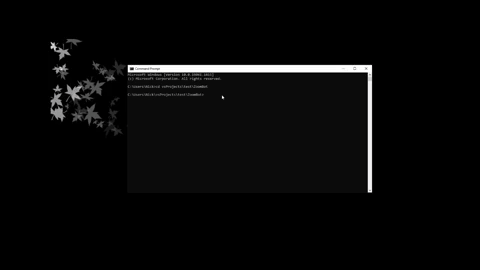

# ZoomBot
Automatically launches and joins a zoom meeting at a given time
## Installation

This project is intended for Windows use only

Clone the repository


```bash
git clone https://github.com/nickkhine/ZoomBot.git
```

Use the package manager [pip](https://pip.pypa.io/en/stable/) to install pyautogui.

```bash
pip install pyautogui
```


## Demo
Change to directory of project and start program with
```bash
python controller.py
```



